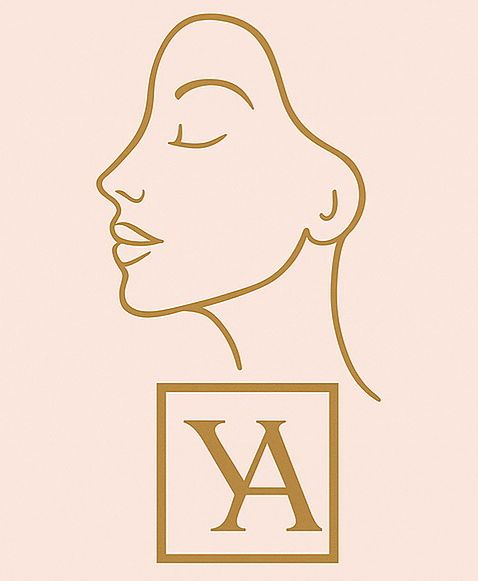
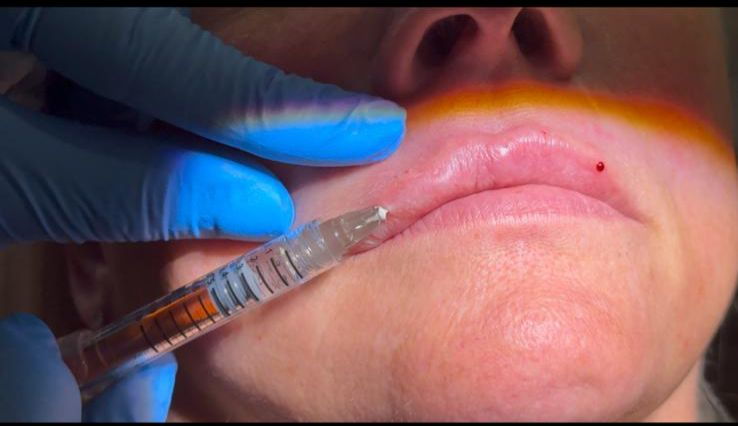
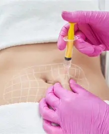
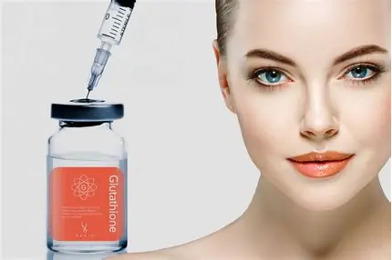

```html
<!doctype html>
<html lang="fr">
<head>
  <meta charset="UTF-8">
  <meta name="viewport" content="width=device-width, initial-scale=1.0">
  <title>YoubiAesthetic</title>
  <link rel="stylesheet" href="style.css">

  <!-- Font Awesome (icônes réseaux sociaux) -->
  <link rel="stylesheet" href="https://cdnjs.cloudflare.com/ajax/libs/font-awesome/6.4.0/css/all.min.css">

</head>
<body>

  <!-- NAVBAR -->
  <header class="site-header">
    <div class="container nav-inner">
      <a class="brand" href="index.html">
        <!-- Place ton PNG converti ici -->
        
      </a>

      <!-- checkbox hack pour menu mobile -->
      <input id="nav-toggle" type="checkbox">
      <label for="nav-toggle" class="nav-toggle-label" aria-hidden="true">
        <span></span><span></span><span></span>
      </label>

      <nav class="main-nav">
        <a href="index.html">Accueil</a>
        <a href="services.html">Services & Tarifs</a>
        <a href="about.html">À propos</a>
        <a href="contact.html">Contact</a>
        <a class="btn-cta" href="mailto:Youbiaesthetic@gmail.com">Prendre RDV</a>
      </nav>
    </div>
  </header>

  <!-- HERO -->
  <section class="hero">
    <div class="container hero-grid">
      <div class="hero-text">
        <h1>YoubiAesthetic</h1>
        <p class="lead">Professional nurse-led enhancements — soins esthétiques sûrs et naturels à Coventry.</p>
        <div class="hero-ctas">
          <a class="btn" href="mailto:Youbiaesthetic@gmail.com">Prendre rendez-vous</a>
          <a class="btn ghost" href="services.html">Voir nos services</a>
          <a class="contact-small" href="https://wa.me/447404555219" target="_blank" rel="noopener">WhatsApp: +44 7404 555219</a>
        </div>
        <ul class="hero-features">
          <li>Consultation: £30 (anti-wrinkle)</li>
          <li>Botox dès £100</li>
          <li>Lip fillers à partir de £100</li>
        </ul>
      </div>

      <div class="hero-media">
        <!-- remplace hero.jpg par une photo professionnelle -->
        
        <div class="callout">
          <strong>Yes, healthy and beautiful results are possible for you</strong>
          <p>Book a consultation — safe, nurse-led treatments.</p>
        </div>
      </div>
    </div>
  </section>

  <!-- PREVIEW DES SERVICES (3 photos demandées) -->
  <section class="services-preview">
    <div class="container">
      <h2>Services populaires</h2>
      <div class="card-row">
        <article class="service-card">
          
          <h3>Lip Filler</h3>
          <p>0.5ML: £100 · 1ML: £150</p>
        </article>

        <article class="service-card">
          
          <h3>Anti-Wrinkle (Botox)</h3>
          <p>From £100</p>
        </article>

        <article class="service-card">
          
          <h3>Fat Dissolving</h3>
          <p>Prix sur consultation</p>
        </article>
      </div>
    </div>
  </section>

  <!-- GALERIE SLIDER (CSS only) -->
  <section class="gallery">
    <div class="container">
      <h2>Galerie</h2>
      <div class="slider">
        <div class="slider-track">
          <!-- Ajoute tes 10 images ici; duplique si tu veux loop plus fluide -->
          <div class="slide"></div>
          <div class="slide"></div>
          <div class="slide"></div>
          <div class="slide"></div>
          <div class="slide"></div>
          <div class="slide"></div>
          <div class="slide"></div>
          <div class="slide"></div>
          <div class="slide"></div>
          <div class="slide"></div>
          <!-- fin slides -->
        </div>
      </div>
    </div>
  </section>

  <!-- QUICK FOOTER -->
  <footer class="site-footer">
    <div class="container footer-grid">
      <div>
        
        <p>17 William McKee Close, Binley, Coventry, CV3 2RD</p>
<!-- Icône Map avec Font Awesome -->
<a href="https://www.google.com/maps/place/Coventry" target="_blank">
    <i class="fas fa-map-marker-alt"></i> Voir sur la carte
</a>

<!-- Ajoute Font Awesome (bibliothèque d’icônes) -->
<script src="https://kit.fontawesome.com/your-kit-code.js" crossorigin="anonymous"></script>

        <p>Email: <a href="mailto:Youbiaesthetic@gmail.com">Youbiaesthetic@gmail.com</a></p>
        <p>Téléphone: <a href="tel:+447404555219">+44 7404 555219</a></p>
      </div>

      <div>
        <h4>Liens</h4>
        <nav class="footer-nav">
          <a href="services.html">Services</a>
          <a href="about.html">À propos</a>
          <a href="contact.html">Contact</a>
          <a href="https://www.linkedin.com/in/TONPROFIL" target="_blank">LinkedIn</a>
        </nav>
      </div>

      <div>
        <h4>Réseaux</h4>
        <div class="socials">
          <!-- Remplace # par tes URL -->
          <a href="#" aria-label="TikTok">TikTok</a>
          <a href="#" aria-label="Instagram">Instagram</a>
          <a href="#" aria-label="Facebook">Facebook</a>
        </div>
      </div>
    </div>
    <div class="copyright">© <span id="year"></span> YoubiAesthetic</div>
  </footer>

<script>
  // simple small helper pour l'année ; si tu veux 100% sans JS supprime ce <script> et remplace manuellement.
  document.getElementById('year').textContent = new Date().getFullYear();
</script>
<footer>
  <div class="social-icons">
    <a href="https://www.instagram.com/toncompte" target="_blank"><i class="fab fa-instagram"></i></a>
    <a href="https://www.facebook.com/toncompte" target="_blank"><i class="fab fa-facebook"></i></a>
    <a href="https://www.tiktok.com/@toncompte" target="_blank"><i class="fab fa-tiktok"></i></a>
    <a href="https://www.linkedin.com/in/tonprofil" target="_blank"><i class="fab fa-linkedin"></i></a>
    <a href="https://wa.me/447404555219" target="_blank"><i class="fab fa-whatsapp"></i></a>
  </div>
  <p>© 2025 YoubiAesthetic - Tous droits réservés</p>
</footer>
</body>
</html>

```
```html
<!doctype html>
<html lang="fr">
<head>
  <meta charset="UTF-8">
  <meta name="viewport" content="width=device-width, initial-scale=1.0">
  <title>YoubiAesthetic</title>
  <link rel="stylesheet" href="style.css">

  <!-- Font Awesome (icônes réseaux sociaux) -->
  <link rel="stylesheet" href="https://cdnjs.cloudflare.com/ajax/libs/font-awesome/6.4.0/css/all.min.css">

</head>
<body>

  <!-- NAVBAR -->
  <header class="site-header">
    <div class="container nav-inner">
      <a class="brand" href="index.html">
        <!-- Place ton PNG converti ici -->
        
      </a>

      <!-- checkbox hack pour menu mobile -->
      <input id="nav-toggle" type="checkbox">
      <label for="nav-toggle" class="nav-toggle-label" aria-hidden="true">
        <span></span><span></span><span></span>
      </label>

      <nav class="main-nav">
        <a href="index.html">Accueil</a>
        <a href="services.html">Services & Tarifs</a>
        <a href="about.html">À propos</a>
        <a href="contact.html">Contact</a>
        <a class="btn-cta" href="mailto:Youbiaesthetic@gmail.com">Prendre RDV</a>
      </nav>
    </div>
  </header>

  <!-- HERO -->
  <section class="hero">
    <div class="container hero-grid">
      <div class="hero-text">
        <h1>YoubiAesthetic</h1>
        <p class="lead">Professional nurse-led enhancements — soins esthétiques sûrs et naturels à Coventry.</p>
        <div class="hero-ctas">
          <a class="btn" href="mailto:Youbiaesthetic@gmail.com">Prendre rendez-vous</a>
          <a class="btn ghost" href="services.html">Voir nos services</a>
          <a class="contact-small" href="https://wa.me/447404555219" target="_blank" rel="noopener">WhatsApp: +44 7404 555219</a>
        </div>
        <ul class="hero-features">
          <li>Consultation: £30 (anti-wrinkle)</li>
          <li>Botox dès £100</li>
          <li>Lip fillers à partir de £100</li>
        </ul>
      </div>

      <div class="hero-media">
        <!-- remplace hero.jpg par une photo professionnelle -->
        
        <div class="callout">
          <strong>Yes, healthy and beautiful results are possible for you</strong>
          <p>Book a consultation — safe, nurse-led treatments.</p>
        </div>
      </div>
    </div>
  </section>

  <!-- PREVIEW DES SERVICES (3 photos demandées) -->
  <section class="services-preview">
    <div class="container">
      <h2>Services populaires</h2>
      <div class="card-row">
        <article class="service-card">
          
          <h3>Lip Filler</h3>
          <p>0.5ML: £100 · 1ML: £150</p>
        </article>

        <article class="service-card">
          
          <h3>Anti-Wrinkle (Botox)</h3>
          <p>From £100</p>
        </article>

        <article class="service-card">
          
          <h3>Fat Dissolving</h3>
          <p>Prix sur consultation</p>
        </article>
      </div>
    </div>
  </section>

  <!-- GALERIE SLIDER (CSS only) -->
  <section class="gallery">
    <div class="container">
      <h2>Galerie</h2>
      <div class="slider">
        <div class="slider-track">
          <!-- Ajoute tes 10 images ici; duplique si tu veux loop plus fluide -->
          <div class="slide"></div>
          <div class="slide"></div>
          <div class="slide"></div>
          <div class="slide"></div>
          <div class="slide"></div>
          <div class="slide"></div>
          <div class="slide"></div>
          <div class="slide"></div>
          <div class="slide"></div>
          <div class="slide"></div>
          <!-- fin slides -->
        </div>
      </div>
    </div>
  </section>

  <!-- QUICK FOOTER -->
  <footer class="site-footer">
    <div class="container footer-grid">
      <div>
        
        <p>17 William McKee Close, Binley, Coventry, CV3 2RD</p>
		<!-- Icône Map avec Font Awesome -->
<a href="https://www.google.com/maps/place/Coventry" target="_blank">
    <i class="fas fa-map-marker-alt"></i> Voir sur la carte
</a>

<!-- Ajoute Font Awesome (bibliothèque d’icônes) -->
<script src="https://kit.fontawesome.com/your-kit-code.js" crossorigin="anonymous"></script>

        <p>Email: <a href="mailto:Youbiaesthetic@gmail.com">Youbiaesthetic@gmail.com</a></p>
        <p>Téléphone: <a href="tel:+447404555219">+44 7404 555219</a></p>
      </div>

      <div>
        <h4>Liens</h4>
        <nav class="footer-nav">
          <a href="services.html">Services</a>
          <a href="about.html">À propos</a>
          <a href="contact.html">Contact</a>
          <a href="https://www.linkedin.com/in/TONPROFIL" target="_blank">LinkedIn</a>
        </nav>
      </div>

      <div>
        <h4>Réseaux</h4>
        <div class="socials">
          <!-- Remplace # par tes URL -->
          <a href="#" aria-label="TikTok">TikTok</a>
          <a href="#" aria-label="Instagram">Instagram</a>
          <a href="#" aria-label="Facebook">Facebook</a>
        </div>
      </div>
    </div>
    <div class="copyright">© <span id="year"></span> YoubiAesthetic</div>
  </footer>

<script>
  // simple small helper pour l'année ; si tu veux 100% sans JS supprime ce <script> et remplace manuellement.
  document.getElementById('year').textContent = new Date().getFullYear();
</script>
<footer>
  <div class="social-icons">
    <a href="https://www.instagram.com/toncompte" target="_blank"><i class="fab fa-instagram"></i></a>
    <a href="https://www.facebook.com/toncompte" target="_blank"><i class="fab fa-facebook"></i></a>
    <a href="https://www.tiktok.com/@toncompte" target="_blank"><i class="fab fa-tiktok"></i></a>
    <a href="https://www.linkedin.com/in/tonprofil" target="_blank"><i class="fab fa-linkedin"></i></a>
    <a href="https://wa.me/447404555219" target="_blank"><i class="fab fa-whatsapp"></i></a>
  </div>
  <p>© 2025 YoubiAesthetic - Tous droits réservés</p>
</footer>
</body>
</html>

```
```html
<!doctype html>
<html lang="fr">
<head>
  <meta charset="UTF-8">
  <meta name="viewport" content="width=device-width, initial-scale=1.0">
  <title>YoubiAesthetic</title>
  <link rel="stylesheet" href="style.css">

  <!-- Font Awesome (icônes réseaux sociaux) -->
  <link rel="stylesheet" href="https://cdnjs.cloudflare.com/ajax/libs/font-awesome/6.4.0/css/all.min.css">

</head>
<body>

  <!-- NAVBAR -->
  <header class="site-header">
    <div class="container nav-inner">
      <a class="brand" href="index.html">
        <!-- Place ton PNG converti ici -->
        
      </a>

      <!-- checkbox hack pour menu mobile -->
      <input id="nav-toggle" type="checkbox">
      <label for="nav-toggle" class="nav-toggle-label" aria-hidden="true">
        <span></span><span></span><span></span>
      </label>

      <nav class="main-nav">
        <a href="index.html">Accueil</a>
        <a href="services.html">Services & Tarifs</a>
        <a href="about.html">À propos</a>
        <a href="contact.html">Contact</a>
        <a class="btn-cta" href="mailto:Youbiaesthetic@gmail.com">Prendre RDV</a>
      </nav>
    </div>
  </header>

  <!-- HERO -->
  <section class="hero">
    <div class="container hero-grid">
      <div class="hero-text">
        <h1>YoubiAesthetic</h1>
        <p class="lead">Professional nurse-led enhancements — soins esthétiques sûrs et naturels à Coventry.</p>
        <div class="hero-ctas">
          <a class="btn" href="mailto:Youbiaesthetic@gmail.com">Prendre rendez-vous</a>
          <a class="btn ghost" href="services.html">Voir nos services</a>
          <a class="contact-small" href="https://wa.me/447404555219" target="_blank" rel="noopener">WhatsApp: +44 7404 555219</a>
        </div>
        <ul class="hero-features">
          <li>Consultation: £30 (anti-wrinkle)</li>
          <li>Botox dès £100</li>
          <li>Lip fillers à partir de £100</li>
        </ul>
      </div>

      <div class="hero-media">
        <!-- remplace hero.jpg par une photo professionnelle -->
        
        <div class="callout">
          <strong>Yes, healthy and beautiful results are possible for you</strong>
          <p>Book a consultation — safe, nurse-led treatments.</p>
        </div>
      </div>
    </div>
  </section>

  <!-- PREVIEW DES SERVICES (3 photos demandées) -->
  <section class="services-preview">
    <div class="container">
      <h2>Services populaires</h2>
      <div class="card-row">
        <article class="service-card">
          
          <h3>Lip Filler</h3>
          <p>0.5ML: £100 · 1ML: £150</p>
        </article>

        <article class="service-card">
          
          <h3>Anti-Wrinkle (Botox)</h3>
          <p>From £100</p>
        </article>

        <article class="service-card">
          
          <h3>Fat Dissolving</h3>
          <p>Prix sur consultation</p>
        </article>
      </div>
    </div>
  </section>

  <!-- GALERIE SLIDER (CSS only) -->
  <section class="gallery">
    <div class="container">
      <h2>Galerie</h2>
      <div class="slider">
        <div class="slider-track">
          <!-- Ajoute tes 10 images ici; duplique si tu veux loop plus fluide -->
          <div class="slide"></div>
          <div class="slide"></div>
          <div class="slide"></div>
          <div class="slide"></div>
          <div class="slide"></div>
          <div class="slide"></div>
          <div class="slide"></div>
          <div class="slide"></div>
          <div class="slide"></div>
          <div class="slide"></div>
          <!-- fin slides -->
        </div>
      </div>
    </div>
  </section>

  <!-- QUICK FOOTER -->
  <footer class="site-footer">
    <div class="container footer-grid">
      <div>
        
        <p>17 William McKee Close, Binley, Coventry, CV3 2RD</p>
		<!-- Icône Map avec Font Awesome -->
<a href="https://www.google.com/maps/place/Coventry" target="_blank">
    <i class="fas fa-map-marker-alt"></i> Voir sur la carte
</a>

<!-- Ajoute Font Awesome (bibliothèque d’icônes) -->
<script src="https://kit.fontawesome.com/your-kit-code.js" crossorigin="anonymous"></script>

        <p>Email: <a href="mailto:Youbiaesthetic@gmail.com">Youbiaesthetic@gmail.com</a></p>
        <p>Téléphone: <a href="tel:+447404555219">+44 7404 555219</a></p>
      </div>

      <div>
        <h4>Liens</h4>
        <nav class="footer-nav">
          <a href="services.html">Services</a>
          <a href="about.html">À propos</a>
          <a href="contact.html">Contact</a>
          <a href="https://www.linkedin.com/in/TONPROFIL" target="_blank">LinkedIn</a>
        </nav>
      </div>

      <div>
        <h4>Réseaux</h4>
        <div class="socials">
          <!-- Remplace # par tes URL -->
          <a href="#" aria-label="TikTok">TikTok</a>
          <a href="#" aria-label="Instagram">Instagram</a>
          <a href="#" aria-label="Facebook">Facebook</a>
        </div>
      </div>
    </div>
    <div class="copyright">© <span id="year"></span> YoubiAesthetic</div>
  </footer>

<script>
  // simple small helper pour l'année ; si tu veux 100% sans JS supprime ce <script> et remplace manuellement.
  document.getElementById('year').textContent = new Date().getFullYear();
</script>
<footer>
  <div class="social-icons">
    <a href="https://www.instagram.com/toncompte" target="_blank"><i class="fab fa-instagram"></i></a>
    <a href="https://www.facebook.com/toncompte" target="_blank"><i class="fab fa-facebook"></i></a>
    <a href="https://www.tiktok.com/@toncompte" target="_blank"><i class="fab fa-tiktok"></i></a>
    <a href="https://www.linkedin.com/in/tonprofil" target="_blank"><i class="fab fa-linkedin"></i></a>
    <a href="https://wa.me/447404555219" target="_blank"><i class="fab fa-whatsapp"></i></a>
  </div>
  <p>© 2025 YoubiAesthetic - Tous droits réservés</p>
</footer>
</body>
</html>

```
```html
<!doctype html>
<html lang="fr">
<head>
  <meta charset="UTF-8">
  <meta name="viewport" content="width=device-width, initial-scale=1.0">
  <title>YoubiAesthetic</title>
  <link rel="stylesheet" href="style.css">

  <!-- Font Awesome (icônes réseaux sociaux) -->
  <link rel="stylesheet" href="https://cdnjs.cloudflare.com/ajax/libs/font-awesome/6.4.0/css/all.min.css">

</head>
<body>

  <!-- NAVBAR -->
  <header class="site-header">
    <div class="container nav-inner">
      <a class="brand" href="index.html">
        <!-- Place ton PNG converti ici -->
        
      </a>

      <!-- checkbox hack pour menu mobile -->
      <input id="nav-toggle" type="checkbox">
      <label for="nav-toggle" class="nav-toggle-label" aria-hidden="true">
        <span></span><span></span><span></span>
      </label>

      <nav class="main-nav">
        <a href="index.html">Accueil</a>
        <a href="services.html">Services & Tarifs</a>
        <a href="about.html">À propos</a>
        <a href="contact.html">Contact</a>
        <a class="btn-cta" href="mailto:Youbiaesthetic@gmail.com">Prendre RDV</a>
      </nav>
    </div>
  </header>

  <!-- HERO -->
  <section class="hero">
    <div class="container hero-grid">
      <div class="hero-text">
        <h1>YoubiAesthetic</h1>
        <p class="lead">Professional nurse-led enhancements — soins esthétiques sûrs et naturels à Coventry.</p>
        <div class="hero-ctas">
          <a class="btn" href="mailto:Youbiaesthetic@gmail.com">Prendre rendez-vous</a>
          <a class="btn ghost" href="services.html">Voir nos services</a>
          <a class="contact-small" href="https://wa.me/447404555219" target="_blank" rel="noopener">WhatsApp: +44 7404 555219</a>
        </div>
        <ul class="hero-features">
          <li>Consultation: £30 (anti-wrinkle)</li>
          <li>Botox dès £100</li>
          <li>Lip fillers à partir de £100</li>
        </ul>
      </div>

      <div class="hero-media">
        <!-- remplace hero.jpg par une photo professionnelle -->
        
        <div class="callout">
          <strong>Yes, healthy and beautiful results are possible for you</strong>
          <p>Book a consultation — safe, nurse-led treatments.</p>
        </div>
      </div>
    </div>
  </section>

  <!-- PREVIEW DES SERVICES (3 photos demandées) -->
  <section class="services-preview">
    <div class="container">
      <h2>Services populaires</h2>
      <div class="card-row">
        <article class="service-card">
          
          <h3>Lip Filler</h3>
          <p>0.5ML: £100 · 1ML: £150</p>
        </article>

        <article class="service-card">
          
          <h3>Anti-Wrinkle (Botox)</h3>
          <p>From £100</p>
        </article>

        <article class="service-card">
          
          <h3>Fat Dissolving</h3>
          <p>Prix sur consultation</p>
        </article>
      </div>
    </div>
  </section>

  <!-- GALERIE SLIDER (CSS only) -->
  <section class="gallery">
    <div class="container">
      <h2>Galerie</h2>
      <div class="slider">
        <div class="slider-track">
          <!-- Ajoute tes 10 images ici; duplique si tu veux loop plus fluide -->
          <div class="slide"></div>
          <div class="slide"></div>
          <div class="slide"></div>
          <div class="slide"></div>
          <div class="slide"></div>
          <div class="slide"></div>
          <div class="slide"></div>
          <div class="slide"></div>
          <div class="slide"></div>
          <div class="slide"></div>
          <!-- fin slides -->
        </div>
      </div>
    </div>
  </section>

  <!-- QUICK FOOTER -->
  <footer class="site-footer">
    <div class="container footer-grid">
      <div>
        
        <p>17 William McKee Close, Binley, Coventry, CV3 2RD</p>
		<!-- Icône Map avec Font Awesome -->
<a href="https://www.google.com/maps/place/Coventry" target="_blank">
    <i class="fas fa-map-marker-alt"></i> Voir sur la carte
</a>

<!-- Ajoute Font Awesome (bibliothèque d’icônes) -->
<script src="https://kit.fontawesome.com/your-kit-code.js" crossorigin="anonymous"></script>

        <p>Email: <a href="mailto:Youbiaesthetic@gmail.com">Youbiaesthetic@gmail.com</a></p>
        <p>Téléphone: <a href="tel:+447404555219">+44 7404 555219</a></p>
      </div>

      <div>
        <h4>Liens</h4>
        <nav class="footer-nav">
          <a href="services.html">Services</a>
          <a href="about.html">À propos</a>
          <a href="contact.html">Contact</a>
          <a href="https://www.linkedin.com/in/TONPROFIL" target="_blank">LinkedIn</a>
        </nav>
      </div>

      <div>
        <h4>Réseaux</h4>
        <div class="socials">
          <!-- Remplace # par tes URL -->
          <a href="#" aria-label="TikTok">TikTok</a>
          <a href="#" aria-label="Instagram">Instagram</a>
          <a href="#" aria-label="Facebook">Facebook</a>
        </div>
      </div>
    </div>
    <div class="copyright">© <span id="year"></span> YoubiAesthetic</div>
  </footer>

<script>
  // simple small helper pour l'année ; si tu veux 100% sans JS supprime ce <script> et remplace manuellement.
  document.getElementById('year').textContent = new Date().getFullYear();
</script>
<footer>
  <div class="social-icons">
    <a href="https://www.instagram.com/toncompte" target="_blank"><i class="fab fa-instagram"></i></a>
    <a href="https://www.facebook.com/toncompte" target="_blank"><i class="fab fa-facebook"></i></a>
    <a href="https://www.tiktok.com/@toncompte" target="_blank"><i class="fab fa-tiktok"></i></a>
    <a href="https://www.linkedin.com/in/tonprofil" target="_blank"><i class="fab fa-linkedin"></i></a>
    <a href="https://wa.me/447404555219" target="_blank"><i class="fab fa-whatsapp"></i></a>
  </div>
  <p>© 2025 YoubiAesthetic - Tous droits réservés</p>
</footer>
</body>
</html>

```
```css
/* = VARIABLES & RESET */
:root{
  --primary: #2f6fbf;    /* bleu hero */
  --accent: #e6cfae;     /* doré/beige (pour harmonie logo) */
  --bg: #fafafa;
  --text: #222;
  --muted: #666;
  --radius: 12px;
  --container: 1100px;
  --shadow: 0 8px 22px rgba(19,24,32,0.08);
  --glass: rgba(255,255,255,0.7);
}
*{box-sizing:border-box}
html,body{height:100%}
body{
  font-family:Inter, system-ui, -apple-system, "Segoe UI", Roboto, "Helvetica Neue", Arial;
  color:var(--text);
  background:var(--bg);
  margin:0;
  -webkit-font-smoothing:antialiased;
  -moz-osx-font-smoothing:grayscale;
}

/* layout container */
.container{max-width:var(--container);margin:0 auto;padding:0 20px}

/* NAVBAR */
.site-header{
  position:sticky;top:0;z-index:60;background:linear-gradient(90deg, rgba(255,255,255,0.85), rgba(255,255,255,0.75));
  backdrop-filter: blur(6px);
  border-bottom:1px solid rgba(0,0,0,0.04);
}
.nav-inner{display:flex;align-items:center;gap:12px;justify-content:space-between;padding:14px 0}
.brand{display:flex;align-items:center;text-decoration:none}
.logo{height:58px;width:auto}
.main-nav{display:flex;gap:18px;align-items:center}
.main-nav a{color:var(--text);text-decoration:none;padding:8px 6px;border-radius:8px;font-weight:600}
.main-nav a:hover{background:rgba(0,0,0,0.04)}

/* CTA bouton */
.btn-cta{background:var(--primary);color:#fff;padding:10px 14px;border-radius:10px}
.btn-cta:hover{opacity:0.95}

/* NAV mobile toggle (checkbox hack) */
#nav-toggle, #nav-toggle-2, #nav-toggle-3, #nav-toggle-4{display:none}
.nav-toggle-label{display:none;cursor:pointer}
.nav-toggle-label span{display:block;width:26px;height:3px;margin:5px;background:#333;border-radius:3px}
@media (max-width:880px){
  .main-nav{position:fixed;right:12px;top:74px;background:#fff;padding:16px;border-radius:10px;box-shadow:var(--shadow);flex-direction:column;display:none}
  .nav-toggle-label{display:block}
  #nav-toggle:checked ~ .main-nav,
  #nav-toggle-2:checked ~ .main-nav,
  #nav-toggle-3:checked ~ .main-nav,
  #nav-toggle-4:checked ~ .main-nav{display:flex}
  .logo{height:48px}
  .btn-cta{display:block}
}

/* HERO */
.hero{padding:40px 0;background:linear-gradient(180deg,var(--primary) 0%, #4b85d4 60%);color:#fff}
.hero-grid{display:grid;grid-template-columns:1fr 480px;gap:30px;align-items:center}
.hero-text h1{font-size:36px;margin:0 0 10px}
.lead{font-size:18px;margin-bottom:14px;opacity:0.95}
.hero-ctas{display:flex;gap:12px;align-items:center;flex-wrap:wrap;margin-bottom:14px}
.btn{display:inline-block;background:#fff;color:var(--primary);padding:10px 16px;border-radius:10px;text-decoration:none;font-weight:700}
.btn.ghost{background:transparent;border:1px solid rgba(255,255,255,0.18);color:#fff}
.contact-small{color:#fff;font-size:14px;opacity:0.95}
.hero-features{list-style:none;padding:0;margin:12px 0 0;color:#f3f6ff}
.hero-features li{display:inline-block;margin-right:16px;font-weight:600;font-size:14px}

/* HERO MEDIA */
.hero-media{position:relative}
.hero-image{width:100%;height:360px;object-fit:cover;border-radius:14px;box-shadow:var(--shadow)}
.callout{position:absolute;left:18px;bottom:-20px;background:#fff;color:#333;padding:16px;border-radius:10px;box-shadow:0 10px 30px rgba(10,20,40,0.12);width:320px}

/* SERVICES PREVIEW */
.services-preview{padding:70px 0;background:#fff}
.services-preview h2{text-align:center;margin-bottom:24px}
.card-row{display:grid;grid-template-columns:repeat(3,1fr);gap:18px}
.service-card{background:#fff;border-radius:12px;padding:12px;text-align:center;box-shadow:var(--shadow);transition:transform .25s}
.service-card img{width:100%;height:200px;object-fit:cover;border-radius:8px}
.service-card h3{margin:12px 0 6px}
.service-card p{color:var(--muted)}

/* GALLERY SLIDER */
.gallery{padding:50px 0;background:linear-gradient(180deg,#fff,#fbfdff)}
.slider{overflow:hidden;border-radius:12px;margin-top:18px}
.slider-track{display:flex;gap:6px;animation:scroll 28s linear infinite}
.slide{min-width:25%;flex:0 0 25%}
.slide img{width:100%;height:160px;object-fit:cover;border-radius:8px}
@keyframes scroll{
  0%{transform:translateX(0)}
  100%{transform:translateX(-50%)}
}

/* SERVICES PAGE STYLES */
.section{padding:40px 0}
.services-grid{display:grid;grid-template-columns:repeat(3,1fr);gap:20px;margin-top:18px}
.service-full{display:flex;gap:18px;align-items:flex-start;background:#fff;padding:14px;border-radius:12px;box-shadow:var(--shadow)}
.service-full img{width:320px;height:220px;object-fit:cover;border-radius:10px}
.service-full-body h2{margin-top:0}
.service-card-large{background:#fff;padding:12px;border-radius:12px;box-shadow:var(--shadow);text-align:center}
.service-card-large img{width:100%;height:200px;object-fit:cover;border-radius:8px}

/* CONTACT */
.contact-grid{display:grid;grid-template-columns:repeat(2,1fr);gap:24px}
.contact-card{background:#fff;padding:16px;border-radius:12px;box-shadow:var(--shadow)}
.contact-card form label{display:block;margin-bottom:10px}
.contact-card input, .contact-card textarea{width:100%;padding:10px;border:1px solid #e6e6e6;border-radius:8px;margin-top:6px}

/* FOOTER */
.site-footer{background:#fff;padding:26px 0;border-top:1px solid rgba(0,0,0,0.04)}
.footer-grid{display:grid;grid-template-columns:1fr 1fr 1fr;gap:12px}
.logo-footer{height:44px}
.footer-nav a{display:block;color:var(--muted);text-decoration:none;margin:6px 0}
.socials a{display:inline-block;margin-right:10px;color:var(--muted);text-decoration:none}
.copyight{font-size:13px;color:var(--muted);text-align:center;padding-top:12px}

/* UTIL */
.muted{color:var(--muted)}

/* RESPONSIVE */
@media (max-width:1100px){
  .hero-grid{grid-template-columns:1fr 380px}
}
@media (max-width:820px){
  .hero-grid{grid-template-columns:1fr;gap:18px}
  .hero-media{order:-1}
  .card-row{grid-template-columns:1fr}
  .services-grid{grid-template-columns:1fr}
  .slider-track{animation-duration:18s}
  .slide{min-width:50%;flex:0 0 50%}
  .contact-grid{grid-template-columns:1fr}
  .footer-grid{grid-template-columns:1fr}
}
@media (max-width:480px){
  .slide img{height:120px}
  .hero-image{height:220px}
}
footer {
  background-color: #f8f8f8;
  padding: 20px;
  text-align: center;
  margin-top: 50px;
}

.social-icons {
  margin-bottom: 15px;
}

.social-icons a {
  color: #555;
  font-size: 28px;
  margin: 0 12px;
  transition: all 0.3s ease;
}

.social-icons a:hover {
  color: #c19a6b; /* couleur dorée qui correspond à ton logo */
  transform: scale(1.2);
}

footer p {
  font-size: 14px;
  color: #777;
}

```


